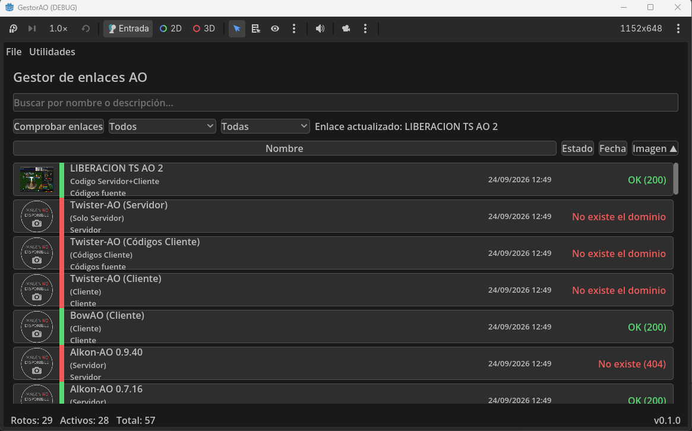
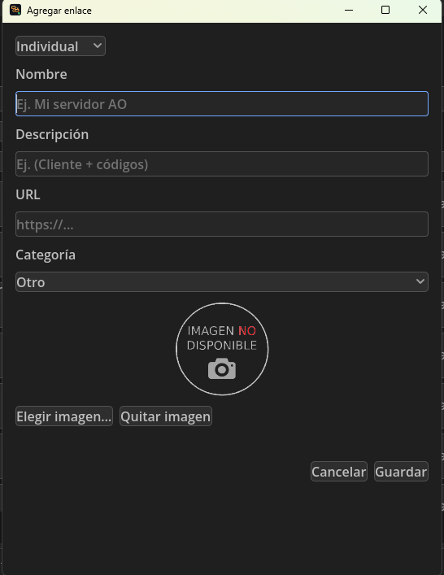

# GestorAO

**Gestor de enlaces para Argentum Online** — aplicación de escritorio en Godot 4 para organizar y verificar la disponibilidad de enlaces de descarga (servidores, clientes y códigos fuente) de proyectos Argentum Online.

> Útil para mantener catálogos históricos de servidores/clients AO: evita enlaces rotos y permite comprobar rápidamente qué archivos siguen disponibles.

---

## Capturas

<p align="center">
  
  
</p>

---

## Características

- 📚 **Listado por catálogo** — listado base en `data/data.json` + enlaces añadidos por el usuario guardados en `user://enlaces.json`.
- 🔎 **Buscador en vivo** — filtra por nombre y descripción mientras escribes.
- ✅ **Verificación de enlaces** — comprueba la disponibilidad HTTP de cada URL con hasta **3 verificaciones en paralelo**, gestionando redirecciones, timeouts y marcadores típicos de archivo eliminado (4shared, RapidShare…).
- 🎛️ **Filtros por estado** — Todos / Válidos / Caídos / Sin comprobar, combinables con categoría y etiqueta.
- 🎛️ **Filtros avanzados** — búsqueda AND/OR por palabras (nombre/descripción/URL), código HTTP (200, 301, 302, 403, 404, 410, 500, 503) y última comprobación (últimos N días); todo combinable con estado, categoría y etiqueta (`#44`).
- ➕ **Añadir enlaces** — ventana con nombre, descripción, URL validada y **captura/imagen opcional** (png/jpg/webp) que se guarda en `Assets/png|jpg` con el nombre del enlace y sin duplicados por contenido (`#36`, `#47`).
- 🏷️ **Etiquetas personalizadas** — campo en el formulario con sugerencias por uso frecuente y filtro por etiqueta, combinable con estado y categoría (`#42`).
- 🖼️ **Miniaturas** — cada fila muestra la captura (56 px) o el marcador `no-disponible` cuando no hay imagen.
- 🧱 **Vista de grilla** — alterna entre lista y cuadrícula de tarjetas con miniatura grande, nombre y estado; filtros y ordenación funcionan igual en ambas vistas y la elegida queda persistida (`#43`).
- 📊 **Dashboard de estadísticas** — desde el menú Utilidades: resumen de disponibilidad (válidos, caídos, sin comprobar y % sobre los comprobados), distribución por categoría y por host (los más problemáticos primero), comprobaciones válidas vs caídas por día y exportación CSV/JSON (`#45`).
- 💾 **Persistencia del escaneo** — los resultados se guardan en `user://estados.json`; no hace falta re-escanear al abrir.
- 🗑️ **Eliminación de enlaces caídos** — con confirmación, registra la URL eliminada (`user://borrados.json`) y borra también su captura de `Assets/png/`.
- 🔁 **Re-verificación individual** — botón *Volver a comprobar* en cada fila caída.
- 🖱️ **Apertura directa** — clic en un enlace lo abre en el navegador del sistema.
- 📊 **Progreso en tiempo real** — contador de verificaciones completadas.
- 🗂️ **Ordenación por columnas** — pulsa las cabeceras de la lista para ordenar por fecha, nombre, imagen o estado (el criterio queda persistido, `#17`).
- 🌐 **Internacionalización ES/EN** — selector de idioma con banderas en Preferencias; todos los textos de la UI se traducen al arrancar según tu elección (`#30`).
- 🎨 **Tema claro/oscuro/automático** — selector en Preferencias; el modo **Automático** detecta el tema del sistema y lo sigue en vivo (`#19`, `#46`).
- 🗂️ **Diálogos de archivo nativos** — elegir imagen, importar/exportar catálogo, informes y diagnóstico abren el diálogo nativo del sistema (`#38`).

---

## Requisitos

- **Godot 4.7.2** (motor usará *Forward Plus*, renderizado **D3D12** en Windows).

---

## Instalación y ejecución

```bash
git clone https://github.com/scorpio21/gestor-de-enlaces.git
cd gestor-de-enlaces
godot --path .          # abre el editor
godot -e                # importa y abre el editor con importación de recursos
```

O simplemente abre `project.godot` desde el propio editor de Godot 4.7.2.

La escena principal es `res://scenes/Main.tscn`.

---

## Uso

1. **Abrir la aplicación** — se carga el catálogo base (`data/data.json`), los enlaces de usuario (`user://enlaces.json`) y el estado del último escaneo (`user://estados.json`).
2. **Comprobar enlaces** — pulsa **Comprobar** para verificar todos los enlaces visibles (o los que el filtro deje ver). Los resultados se muestran en cada fila y quedan guardados:
   - 🟢 **Válido** — el archivo responde `200`-`3xx`.
   - 🟡 **Válido con aviso** — el enlace responde, pero el certificado TLS no es válido y se ha aceptado por preferencia.
   - 🔴 **Caído / no existe** — `404`/`410`, conexión fallida, dominio inexistente, certificado rechazado o marcador de archivo eliminado.
   - 🟡 **Sin comprobar** — pendiente de verificación, o un fallo del entorno (red, corte de conexión, `503` agotado) que no se ha podido confirmar como caída.
3. **Filtrar** — usa el desplegable para ver solo válidos, caídos o sin comprobar.
4. **Buscar** — escribe en el campo de búsqueda para filtrar por nombre/descripción.
5. **Añadir** — menú *Utilidades → Agregar* (o atajo directo). La URL debe empezar por `http://` o `https://`; opcionalmente elige una **imagen/captura local** (png/jpg/webp) que se copia a `Assets/png|jpg` guardada con el nombre del enlace y se muestra como miniatura al guardar.
6. **Abrir enlace** — clic sobre la fila del enlace.
7. **Re-verificar un caído** — botón *Volver a comprobar* en la fila.
8. **Eliminar un caído** — botón *Eliminar* (con confirmación); se registra la URL como eliminada y se borra su captura de `Assets/png/`.

### Preferencias → Escaneo

Tres opciones que solo afectan a **cómo se comprueba**, no a **qué se comprueba**:

| Opción | Por defecto | Qué hace |
| --- | --- | --- |
| Reintentar los fallos transitorios (2 veces) | activada | Un fallo del entorno (red, corte de conexión, `429`, `503`) se reintenta con esperas crecientes antes de darlo por caído. |
| Marcar los fallos de red como «sin comprobar» | activada | Si aun así no se puede confirmar, el enlace queda como **sin comprobar** en vez de **caído**, para no ofrecer "Eliminar" por un fallo ajeno. |
| Aceptar los certificados TLS no válidos | **desactivada** | Un certificado caducado, autofirmado o de otro dominio deja de marcar el enlace como caído. |

Sobre la tercera: es una **opción de compatibilidad**, no algo que deba activarse por costumbre. Sin validación del certificado, cualquiera que se interponga en la conexión puede sustituir el archivo o redirigir la descarga. Actívala solo si tu catálogo tiene hostings antiguos con certificados caducados y aceptas ese riesgo a cambio de que el archivo no desaparezca del catálogo.

La comprobación es siempre en dos pasos: primero se valida el certificado como siempre. Solo si **el handshake falla de verdad** se repite la conexión sin validar, de modo que la revisión se mantiene intacta para los enlaces con buen certificado. Si esa segunda conexión funciona, el enlace se marca como **válido con aviso** (sigue contando como disponible y no aparece entre los problemáticos); si tampoco funciona, se informa de que **no hay conexión segura** y el enlace no se da por bueno. Con la opción desactivada, un certificado no válido sigue marcando el enlace como **caído**.

---

## Almacenamiento de datos

| Ruta | Contenido |
|---|---|
| `res://data/data.json` | Catálogo base (solo lectura en builds exportados) |
| `user://enlaces.json` | Enlaces añadidos por el usuario |
| `user://estados.json` | Resultados del último escaneo por URL |
| `user://borrados.json` | URLs eliminadas definitivamente |
| `user://logs/` | Logs rotativos de aplicación (`app_*.log`) y de escaneo (`scan_*.log`) |
| `Assets/png/`, `Assets/jpg/` | Capturas de los enlaces, guardadas con el nombre del enlace (carpetas versionadas) |
| `data/data.json.bak` | Copia de seguridad local (no versionada) |

> `user://` equivale a la carpeta de datos del usuario del sistema según el sistema operativo.

### Modos de almacenamiento

Desde *Preferencias → Almacenamiento* se elige **cómo** se guardan los datos; la tabla anterior
describe el modo por defecto (**Ficheros sueltos**):

| Modo | Fichero(s) | Notas |
|---|---|---|
| **Ficheros sueltos** | los ocho JSON de `user://` | Por defecto; igual que las versiones anteriores. |
| **Fichero único** | `gestorao.json` en la carpeta de datos | Las ocho secciones dentro de un JSON, con `schema_version` por sección. |
| **Base de datos** | `gestorao.db` (SQLite) | Una tabla por sección, con la carga útil en JSON; requiere el addon `godot-sqlite`. |

Cambiar de modo o de carpeta **migra** los datos (copia + verificación por recuento) y se aplica
al reiniciar, porque los stores ya tienen sus rutas abiertas. La preferencia de almacenamiento
vive siempre en `user://almacenamiento.json`, aunque los datos se muevan. La carpeta también se
puede elegir por línea de órdenes (`-- --almacen=<ruta>`) o con las variables `GESTORAO_ALMACEN`
y `GESTORAO_BASE`.

---

## Registro de actividad y diagnóstico

- **Logger rotativo** — la aplicación escribe logs a `user://logs/` con rotación por tamaño; por un lado la actividad de la app y por otro los escaneos de enlaces. En *entornos de desarrollo* (sin exportar) el logger también vuelca a consola.
- **Exportar diagnóstico** — menú *Utilidades → Exportar diagnóstico…* genera un ZIP (fecha/hora en el nombre) con los logs, los datos (`data.json`, `enlaces.json`, `estados.json`, `borrados.json`) y un fichero `info.txt` con versión de la app, SO, motor y rutas, para reportar incidencias.

---

## Empaquetado y CI

- **Presets de exportación** (`export_presets.cfg`) — Windows (exe), Linux/X11 (x86_64) y macOS (`.app` universal). La escena principal y los iconos (SVG/PNG/ICO/ICNS) se generan con `scripts/generar_iconos.gd`.
- **GitHub Actions** (`.github/workflows/ci.yml`) — en cada push a `main`: descarga Godot 4.7.2 y las export templates (versión fija `4.7.2.stable`), importa el proyecto, ejecuta la batería de tests headless y exporta los 3 presets a `build/` (el `.app` de macOS se comprime a ZIP). Los artefactos quedan publicados en la página del run.
- **Batería de tests** — cada suite es `tests/test_<area>.gd` (extiende `SceneTree`; imprime `TESTS OK` y `quit(0)`). `tests/run_battery.sh` ejecuta las 61 suites en orden; local (Windows, pwsh):

  ```bash
  & "K:\Godot_v4.6.1\Godot_v4.7.2-stable_win64_console.exe" --headless --path "K:\gestor-de-enlaces" --script res://tests/test_<area>.gd
  ```

  En CI el checkout es fresco (no trae `.godot/`): antes de la batería se ejecuta `godot --headless --path . --import` para generar el cache de importación.

---

## Estructura del proyecto

```
gestor-de-enlaces/
├── project.godot            # Configuración del proyecto
├── export_presets.cfg       # Presets de exportación Windows/Linux/macOS
├── LICENSE                  # Licencia del proyecto (MIT)
├── NOTICE                   # Aviso de componentes de terceros
├── CHANGELOG.md             # Histórico de cambios por día
├── .github/workflows/ci.yml # CI: tests headless + export de los 3 bundles
├── scenes/                  # 10 escenas
│   ├── Main.tscn            # Escena principal (UI completa)
│   ├── Dashboard.tscn       # Dashboard de estadísticas
│   ├── Historial.tscn       # Historial de comprobaciones
│   ├── Cambios.tscn         # Resumen de cambios entre escaneos
│   ├── AgregarEnlace.tscn   # Ventana para añadir/editar enlaces
│   ├── Preferencias.tscn    # Preferencias (escaneo, tema, idioma, almacenamiento)
│   ├── ListItem.tscn        # Fila del listado
│   ├── GridItem.tscn        # Celda de la grilla
│   ├── FilaTabla.tscn       # Fila de tabla del dashboard
│   └── TarjetaKpi.tscn      # Tarjeta de KPI del dashboard
├── scripts/                 # 54 scripts (Integración + stores + controladores)
│   ├── main.gd              # Integración: almacén, stores, UI y escaneo
│   ├── almacen.gd           # Interfaz de almacenamiento + escritura atómica
│   ├── almacen_json.gd      # Backend: ficheros sueltos (8 JSON)
│   ├── almacen_uno.gd       # Backend: fichero único (gestorao.json)
│   ├── almacen_bd.gd        # Backend: base de datos SQLite (gestorao.db)
│   ├── almacen_controller.gd# Fábrica de backends y migración
│   ├── link_checker.gd      # Verificador HTTP (redirecciones, timeouts…)
│   ├── list_item.gd         # Fila: estado, verificación y apertura
│   ├── *_controller.gd      # scan, lista, catálogo, config, selección, informe, cambios
│   ├── *_store.gd           # estado, config, cola, presets, instantáneas, cambios, informe, dashboard
│   ├── agregar_enlace.gd    # Formulario de nuevo enlace (+ captura)
│   ├── logger.gd            # Logs rotativos app/scan en user://logs
│   ├── diagnostico.gd       # Exporta ZIP de logs+datos con info.txt
│   ├── gestor_datos.gd      # Carga/guardado JSON con backups
│   ├── gestor_catalogo.gd   # Catálogo base y enlaces de usuario
│   ├── gestor_contadores.gd # Contadores de la barra de estado
│   ├── historial.gd         # Historial de escaneos del catálogo
│   ├── preferencias.gd      # Ventana de preferencias
│   ├── gestor_archivo.gd    # Selección y copia de capturas
│   ├── gestor_imagenes.gd   # Copia de capturas a Assets/png
│   ├── extraer_cadenas.gd   # Scanner de cadenas de la UI
│   └── generar_iconos.gd    # Regenera Assets/icon (svg/png/ico/icns)
├── tests/
│   ├── run_battery.sh       # Ejecuta las 61 suites headless (Linux/Windows/CI)
│   ├── run_estatico.sh      # --check-only de los .gd antes de la batería
│   ├── run_smoke.sh         # Arranca el binario exportado (-- --smoke)
│   └── test_<area>.gd       # 61 suites SceneTree (TESTS OK / quit(0))
├── locale/
│   └── gestor_es_en.csv     # Traducciones ES/EN (clave ES, valor ES, valor EN)
├── addons/
│   ├── godot_ai/            # Plugin de editor Godot AI (MCP, tercero MIT)
│   └── godot-sqlite/        # Backend SQLite (tercero MIT) para el modo Base de datos
├── data/
│   └── data.json            # Catálogo base de enlaces
├── Assets/
│   └── icon/                # Iconos generados (svg/png/ico/icns)
└── docs/superpowers/        # Specs y planes de diseño
```

---

## Roadmap

- [x] Listado de enlaces, búsqueda y filtros por estado
- [x] Verificación HTTP en paralelo con detección de archivos eliminados
- [x] Alta de enlaces desde la interfaz
- [x] **Persistencia del estado de escaneo** (`user://estados.json`) — los resultados se guardan y no hace falta re-escanear al abrir
- [x] **Eliminación de enlaces caídos** con confirmación y control de URL eliminadas (`user://borrados.json`)
- [x] Re-verificación individual por enlace
- [x] **Captura/imagen por enlace** — al añadir se puede adjuntar una imagen local que se muestra como miniatura (o el marcador `no-disponible`)
- [x] **Logs rotativos y diagnóstico en ZIP** — logger app/scan en `user://logs/` + *Utilidades → Exportar diagnóstico…* (`#28`)
- [x] **Icono propio y metadatos 0.1.0** — Assets/icon (svg/png/ico/icns) generado por script (`#29`)
- [x] **Empaquetado y CI** — presets Windows/Linux/macOS + GitHub Actions que testea y exporta los 3 bundles (#26)
- [x] **Ordenación por columnas** — cabeceras de la lista con criterio persistido (`#17`)
- [x] **Internacionalización ES/EN** — selector de idioma con banderas y `tr()` en toda la UI (`#30`)
- [x] **Etiquetas personalizadas** — campo con sugerencias por uso frecuente y filtro combinado por etiqueta (`#42`)
- [x] **Barra de estado con colores** — contadores Rotos/Activos/Total en rojo, verde y azul
- [x] **Filtros avanzados** — búsqueda AND/OR, código HTTP y última comprobación por días, combinables; con **presets** guardables y aplicables (`#44`)
- [x] **Vista de grilla** — alterna lista/cuadrícula de tarjetas con la vista elegida persistida (`#43`)
- [x] **Dashboard de estadísticas** — resumen de disponibilidad, distribución por categoría/host y exportación CSV/JSON (`#45`)
- [x] **Tema claro/oscuro/automático** — selector en Preferencias con detección del tema del sistema (`#19`, `#46`)
- [x] **Capturas con nombre y deduplicadas** — guardado con el nombre del enlace y reutilización por contenido (`#36`, `#47`)
- [x] **Diálogos de archivo nativos del sistema** (`#38`)

> El diseño de cada funcionalidad está especificado en `docs/superpowers/specs/` (`2026-09-05-estado-escaneo-enlaces-design.md`, `2026-09-05-captura-enlaces-design.md`).

---

## Licencia

Uso libre para la comunidad de Argentum Online. Los enlaces del catálogo pertenecen a sus respectivos autores/proyectos.